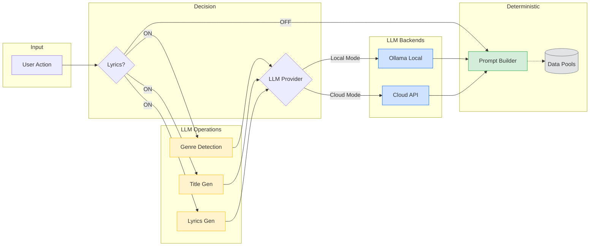

# suno-prompting-app

Desktop app that turns plain-English song ideas into **Suno V5-ready** prompts with genre/mood/instrument guidance and enforced formatting.

[Quick Start](#quick-start) | [Configuration](#configuration) | [Features](#features) | [Modes](#modes) | [Genre Detection](#genre-detection) | [Reference](#reference) | [Architecture](#architecture) | [Tech Stack](#tech-stack)

## Quick Start

Prereq: [Bun](https://bun.sh/)

```bash
bun install
bun start
```

Run tests: `bun test` | Validate: `bun run validate`

<details>
<summary><strong>Build Commands</strong></summary>

| Command | Description |
|---------|-------------|
| `bun run build` | Development build |
| `bun run build:stable` | Production (current platform) |
| `bun run build:stable:all` | Production (all platforms) |
| `bun run build:macos` | macOS (Intel & Apple Silicon) |
| `bun run build:linux` | Linux (x64) |
| `bun run build:windows` | Windows (x64) |

</details>

## Configuration

Settings and API keys stored locally (encrypted with AES-256-GCM):

| Platform | Location |
|----------|----------|
| macOS/Linux | `~/.suno-prompting-app/config.json` |
| Windows | `C:\Users\<username>\.suno-prompting-app\config.json` |

### AI Providers

| Provider | Models | Setup |
|----------|--------|-------|
| **Ollama (Local)** | Gemma 3 4B | [ollama.ai/download](https://ollama.ai/download) - **No API key required** |
| Groq | GPT OSS 120B, Llama 3.1 8B | [console.groq.com/keys](https://console.groq.com/keys) |
| OpenAI | GPT-5 Mini, GPT-5 | [platform.openai.com/api-keys](https://platform.openai.com/api-keys) |
| Anthropic | Claude Sonnet 4.5, Claude Haiku 4.5 | [console.anthropic.com](https://console.anthropic.com) |

### Local LLM Mode (Ollama)

Run AI generation **100% offline and private** with no API keys required.

#### Quick Start

**macOS (Recommended):**
1. Download and install from [ollama.com/download/mac](https://ollama.com/download/mac)
2. Ollama starts automatically after installation
3. Pull the model: `ollama pull gemma3:4b`

**Linux:**
```bash
curl -fsSL https://ollama.ai/install.sh | sh
ollama serve
ollama pull gemma3:4b
```

**Windows:**
1. Download installer from [ollama.ai/download](https://ollama.ai/download)
2. Run installer and start Ollama from Start menu
3. Pull the model: `ollama pull gemma3:4b`

The app automatically detects Ollama and switches to local mode.

**Model:** Gemma 3 4B (~2.5GB) - Balanced speed and quality, optimized for prompt generation.

#### How It Works

**Smart Defaults:**
- No API keys configured → Auto-enables Local LLM
- API key added → Uses cloud provider (can toggle back to local in Settings)
- Your choice persists across sessions

**Benefits:**
- ✅ **100% Private** - No data sent to cloud
- ✅ **Offline** - No internet required
- ✅ **Free** - No API costs
- ✅ **Fast** - Local inference

**Note:** For highest quality lyrics/titles, consider using cloud providers (Groq/OpenAI/Anthropic).

## Features

- **Local LLM support**: 100% offline AI generation with Ollama (no API keys, fully private)
- **Structured prompts** from plain English with `Genre:`, `BPM:`, `Mood:`, `Instruments:` fields
- **Three generation modes**: Full Prompt, Quick Vibes, Creative Boost
- **Max Mode**: Community-discovered format for higher quality output
- **Dynamic instrument selection** from curated pools with exclusion rules
- **Genre detection**: Keyword matching → spelling correction → LLM analysis
- **Quick remix buttons** for mood/genre/instruments/style/recording
- **Lyrics Mode**: Optional AI-generated structured lyrics
- **1000-character limit** validation + contradictory tag warnings

## Modes

### Full Prompt Mode (Default)

Generate structured prompts with optional Advanced Mode for precise genre control.

**Output format:**
```
[Mood, Genre/Style, Key: key/mode]

Genre: jazz
BPM: 110
Mood: smooth, warm
Instruments: Rhodes, upright bass, brushed drums

[INTRO] Warm piano chords...
[VERSE] Gentle melody...
```

<details>
<summary><strong>Advanced Mode</strong></summary>

Searchable dropdowns for precise selection:

| Option | Choices |
|--------|---------|
| Single Genre | <!-- SINGLE_GENRE_COUNT -->35<!-- /SINGLE_GENRE_COUNT --> genres |
| Genre Combination | <!-- MULTI_GENRE_COUNT -->108<!-- /MULTI_GENRE_COUNT --> combos |
| Harmonic Style | Modes (Dorian, Lydian, Phrygian, etc.) |
| Modal Combination | Journeys (Major-Minor, Lydian-Minor, etc.) |
| Polyrhythm | Rhythmic patterns |
| Time Signature | Standard and odd meters (7/8, 5/4, etc.) |

</details>

### Quick Vibes

Simplified 60-character prompts for ambient/background music.

<details>
<summary><strong>Category Presets</strong></summary>

| Category | Description |
|----------|-------------|
| Lo-fi / Study | Chill beats for focus |
| Cafe / Coffee shop | Cozy acoustic and jazz |
| Ambient / Focus | Atmospheric soundscapes |
| Late night / Chill | Mellow listening |
| Cozy / Rainy day | Warm sounds |

</details>

### Creative Boost

Experimental genre exploration with creativity slider (0-100%).

| Level | Behavior |
|-------|----------|
| 0% Low | Single genres, pure and traditional |
| 25% Safe | Established combinations |
| 50% Normal | Balanced mix |
| 75% Adventurous | Unusual combinations |
| 100% High | Experimental fusions |

<details>
<summary><strong>Simple vs Advanced Mode</strong></summary>

| Feature | Simple | Advanced |
|---------|--------|----------|
| Creativity Slider | ✅ | ✅ |
| Description Input | ✅ | ✅ |
| Toggles (Lyrics, Wordless, Max) | ✅ | ✅ |
| Seed Genres (up to 4) | ❌ | ✅ |
| Suno V5 Styles (~900+) | ❌ | ✅ |

**Seed Genres vs Suno V5 Styles** (mutually exclusive):

| Selector | Source | Format |
|----------|--------|--------|
| Seed Genres | App registry (<!-- SINGLE_GENRE_COUNT -->35<!-- /SINGLE_GENRE_COUNT --> + <!-- MULTI_GENRE_COUNT -->108<!-- /MULTI_GENRE_COUNT --> combos) | Title Case |
| Suno V5 Styles | Official Suno V5 (~900+) | lowercase as-is |

</details>

### Max Mode

Community-discovered format for higher quality, realistic output. Best for organic genres (country, folk, jazz, blues, rock).

```
[Is_MAX_MODE: MAX](MAX)
[QUALITY: MAX](MAX)
[REALISM: MAX](MAX)
[REAL_INSTRUMENTS: MAX](MAX)
genre: "acoustic, country singer-songwriter"
bpm: "95"
instruments: "acoustic guitar, baritone vocals, raspy vocals"
style tags: "tape recorder, raw performance, natural dynamics"
recording: "one person, one guitar, vintage microphone"
```

<details>
<summary><strong>Max Mode Details</strong></summary>

**Key differences from normal mode:**

| Aspect | Normal Mode | Max Mode |
|--------|-------------|----------|
| Format | Section tags `[VERSE]`, `[CHORUS]` | Metadata `genre:`, `instruments:` |
| Focus | Song structure | Recording quality & realism |

**Auto-conversion:** Pasting a standard format prompt with Max Mode enabled automatically converts it.

**Not recommended for:** EDM, house, techno, synthwave (use normal mode).

</details>

## Genre Detection

3-tier system: Keywords → Spelling Correction → LLM Analysis

<details>
<summary><strong>Genre Priority Order</strong></summary>

<!-- GENRE_PRIORITY_START -->

```
videogame → synthwave → lofi → cinematic → jazz → classical → folk → rnb →
country → soul → blues → punk → latin → symphonic → metal → trap →
retro → disco → funk → reggae → afrobeat → house → trance → downtempo →
dreampop → chillwave → newage → hyperpop → drill → melodictechno → indie → electronic →
rock → pop → ambient
```

<!-- GENRE_PRIORITY_END -->

First match wins. Keyword-detected genre always takes precedence over LLM-selected genre.

</details>

## Reference

### Genres

<details>
<summary><strong>35 Genres with Keywords & Instruments</strong></summary>

<!-- GENRE_TABLE_START -->

| Genre | Keywords | Key Instruments |
|-------|----------|-----------------|
| Ambient | ambient, atmospheric, soundscape, drone, ethereal, textural | synth pad, ambient pad, analog synth pads, shimmer pad, crystalline synth pads, Moog synth, granular synth, wavetable synth, FM synth, modular synth, drone, tape loops, field recordings, guitar, processed guitar, e-bow guitar, glass bells, vibraphone, bowed vibraphone, singing bowls, crystal bowls, kalimba, handpan, tongue drum, bansuri, shakuhachi, felt piano, prepared piano, rain stick, suspended cymbal, mark tree, shaker, theremin, waterphone, glass armonica, didgeridoo |
| Jazz | jazz, bebop, swing, cool jazz, fusion, big band, smooth jazz | Rhodes, grand piano, hollowbody guitar, Hammond organ, Wurlitzer, saxophone, tenor sax, alto sax, soprano sax, baritone saxophone, trumpet, muted trumpet, flugelhorn, trombone, vibraphone, clarinet, flute, upright bass, walking bass, jazz brushes, drums, ride cymbal, congas, bongos |
| Electronic | edm, electronic, dubstep, drum and bass, dnb, electro, bass music | synth pad, analog synth, FM synth, arpeggiator, synth, synth choir, supersaw, pluck synth, 808, TR-909, synth bass, TB-303, kick drum, hi-hat, drums, vocoder, FX risers, impacts |
| Rock | rock, alternative, indie rock, hard rock, grunge, classic rock, heartland rock | distorted guitar, Fender Stratocaster, guitar, acoustic guitar, Telecaster, bass, drums, kick drum, toms, electric piano, organ, Clavinet, grand piano, Hammond organ, tambourine |
| Pop | pop, mainstream, top 40, dance pop, synth pop, electropop, future bass | felt piano, Fender Stratocaster, guitar, acoustic guitar, grand piano, synth pad, synth, analog synth, digital synth, arpeggiator, synth piano, supersaw, pluck synth, synth choir, bass, drums, 808, handclaps, kick drum, FX risers, strings |
| Classical | classical, orchestral, symphony, chamber, baroque, romantic, opera | strings, felt piano, violin, cello, viola, flute, alto flute, piccolo, oboe, english horn, clarinet, bass clarinet, bassoon, contrabassoon, french horn, tuba, trombone, bass trombone, harp, celesta, xylophone, triangle, tubular bells, timpani, orchestral bass drum, suspended cymbal, crash cymbal, tam tam, slapstick, recorder, lute, harpsichord, viola da gamba, theorbo, crotales |
| Lo-fi | lofi, lo-fi, study beats, chillhop, lofi hip hop, lofi beats | felt piano, Rhodes, electric piano, vibraphone, kalimba, guitar, cello, clarinet, jazz brushes, shaker, percussion, drums, synth pad, ambient pad |
| Synthwave | synthwave, retrowave, 80s, outrun, vaporwave, darksynth, cyberpunk | analog synth, analog synth pads, FM synth, digital synth, Moog synth, arpeggiator, synth pad, synth, supersaw, synth bass, 808, kick drum, hi-hat, drums, Linn drum |
| Cinematic | cinematic, epic, trailer, film score, soundtrack, orchestral, dramatic, hybrid orchestral | strings, grand piano, string ostinato, pizzicato strings, french horn, low brass, tuba, trombone, cello, choir, wordless choir, solo soprano, violin, celesta, glockenspiel, bells, harp, english horn, piccolo, alto flute, bass flute, tubular bells, xylophone, string tremolo, euphonium, taiko drums, percussion, toms, timpani, orchestral bass drum, tam tam, suspended cymbal, braams, impacts, FX risers, sub-bass, ondes Martenot, col legno, sul ponticello, crotales |
| Folk | folk, acoustic, singer-songwriter, celtic, traditional | acoustic guitar, felt piano, autoharp, mountain dulcimer, violin, harp, flute, harmonica, accordion, clarinet, concertina, cajón, percussion, frame drum, washboard, mandolin, banjo, hurdy gurdy, jaw harp, nyckelharpa |
| R&B | rnb, r&b, neo-soul, contemporary r&b, quiet storm | Rhodes, Wurlitzer, electric piano, grand piano, Clavinet, bass, drums, 808, trap hi hats, slap bass, saxophone, strings, guitar, wah guitar, handclaps, shaker |
| Video Game | video game, game music, gaming, chiptune, 8-bit, 8 bit, retro game, pixel, arcade, boss battle, level music, rpg, jrpg, adventure game, platformer, nintendo, sega | strings, felt piano, harp, synth pad, arpeggiator, FM synth, analog synth, synth strings, bells, glockenspiel, celesta, choir, french horn, trumpet, drums, percussion, taiko drums, timpani, 808, guitar, vocoder |
| Country | country, country rock, country pop, americana, bluegrass, country gospel, honky tonk, outlaw country, nashville | acoustic guitar, Telecaster, grand piano, dobro, lap steel guitar, pedal steel, fiddle, harmonica, mandolin, banjo, autoharp, bass, drums, upright bass, Hammond organ, accordion, washboard, mountain dulcimer |
| Soul | soul, motown, 60s soul, modern soul, gospel soul, northern soul, southern soul, classic soul, quiet storm | Rhodes, grand piano, Hammond organ, Wurlitzer, strings, trumpet, flugelhorn, saxophone, baritone saxophone, low brass, bass, drums, tambourine, handclaps, vibraphone, guitar |
| Blues | blues, electric blues, blues rock, delta blues, chicago blues, jazz blues, slow blues, blues shuffle, psychedelic blues | hollowbody guitar, guitar, grand piano, slide guitar, dobro, lap steel guitar, bass, drums, upright bass, walking bass, Hammond organ, harmonica, saxophone, wah guitar, washboard |
| Punk | punk, pop punk, emo, emo pop, punk rock, hardcore, y2k pop punk, indie pop punk, skate punk, melodic punk | distorted guitar, guitar, acoustic guitar, picked bass, bass, drums, kick drum, grand piano, organ |
| Latin | latin, bossa nova, latin jazz, latin pop, salsa, tango, flamenco, afro-cuban | nylon string guitar, Rhodes, grand piano, acoustic guitar, upright bass, bass, congas, bongos, timbales, claves, shaker, guiro, cowbell, maracas, agogo bells, cabasa, trumpet, saxophone, flute, bandoneon, castanet, vibraphone, cuica, pandeiro, surdo, repinique |
| Metal | metal, heavy metal, doom metal, progressive metal, industrial, death metal, black metal, thrash metal, nu metal, gothic metal | distorted guitar, guitar, seven-string guitar, eight-string guitar, baritone guitar, bass, drums, kick drum, timpani, synth pad, strings, choir, organ, orchestra, braams, low brass |
| Trap | trap, dark trap, emo rap, cloud rap, cinematic trap, trap soul, melodic trap, phonk | felt piano, guitar, pluck synth, strings, bells, 808, trap hi hats, kick drum, snare drum, synth pad, ambient pad, choir, vinyl noise, flute, pizzicato strings, braams, FX risers |
| Retro | retro, 50s, 60s, rock and roll, doo-wop, rockabilly, garage rock, surf rock, british invasion, oldies | guitar, tremolo guitar, grand piano, honky tonk piano, upright bass, slap bass, drums, tambourine, handclaps, organ, saxophone, harmonica, finger snaps, bells |
| Symphonic | symphonic, symphonic metal, symphonic rock, orchestral metal, orchestral rock, epic metal | distorted guitar, guitar, grand piano, strings, choir, french horn, low brass, tuba, trombone, violin, cello, orchestra, euphonium, string tremolo, bass, drums, timpani, kick drum, orchestral bass drum, harp, celesta, braams, wordless choir, solo soprano, tam tam, crash cymbal, tubular bells, xylophone |
| Disco | disco, nu-disco, nu disco, boogie, funky house, disco house, studio 54 | Rhodes, Wurlitzer, strings, Clavinet, slap bass, wah guitar, low brass, trumpet, saxophone, flute, kick drum, hi-hat, drums, tambourine, handclaps, congas, synth strings, analog synth pads, synth pad, orchestra hit |
| Funk | funk, funky, p-funk, parliament, funkadelic, groove | Clavinet, Rhodes, Wurlitzer, Hammond organ, slap bass, wah guitar, low brass, trumpet, tenor sax, trombone, talkbox, drums, hi-hat, handclaps, congas, bongos, tambourine, cowbell, vocoder, synth bass |
| Reggae | reggae, roots reggae, dancehall, ska, rocksteady, jamaican, dub music, dub reggae | organ, electric piano, Rhodes, melodica, guitar, bass, trumpet, trombone, saxophone, drums, nyabinghi drums, hi-hat, percussion, spring reverb, tape delay, dub siren |
| Afrobeat | afrobeat, afrobeats, amapiano, afropop, afro house, african, nigerian, south african | Rhodes, electric piano, synth, guitar, kora, talking drum, balafon, kalimba, shekere, saxophone, baritone saxophone, trumpet, ogene, djembe, percussion, drums, congas, shaker, 808, agogo bells, udu drum, synth pad, analog synth pads, log drums |
| House | house, deep house, tech house, progressive house, chicago house, garage, uk garage | synth pad, analog synth pads, sidechain pad, synth strings, Rhodes, electric piano, grand piano, organ, kick drum, hi-hat, 808, TR-909, handclaps, shaker, percussion, cowbell, congas, bongos, synth bass, bass, saxophone, choir, stabs, vocal chops |
| Trance | trance, psytrance, progressive trance, uplifting trance, vocal trance, goa, eurodance | supersaw, arpeggiator, synth pad, analog synth, pluck synth, gated pad, kick drum, hi-hat, 808, synth bass, grand piano, strings, synth strings, choir, wordless choir, solo soprano, synth choir, FX risers, impacts |
| Downtempo | downtempo, trip hop, trip-hop, triphop, chillout, chill out, slow electronic | synth pad, ambient pad, analog synth pads, shimmer pad, granular synth, Rhodes, electric piano, felt piano, vibraphone, drums, hi-hat, percussion, bass, synth bass, shaker, breakbeat, saxophone, trumpet, flute, wordless choir, strings, violin, vinyl noise, tape loops |
| Dream Pop | dream pop, dreampop, shoegaze, ethereal, dreamy, hazy | synth pad, shimmer pad, ambient pad, synth strings, guitar, tremolo guitar, synth, felt piano, drums, bass, hi-hat, shaker, tambourine, wordless choir, strings, glockenspiel, bells |
| Chillwave | chillwave, glo-fi, hypnagogic, bedroom pop, chillsynth | analog synth pads, synth pad, arpeggiator, synth, drums, synth bass, hi-hat, 808, shaker, guitar, Rhodes, felt piano, Wurlitzer, vinyl noise, tape loops, saxophone, wordless choir, glockenspiel |
| New Age | new age, newage, meditation, healing, spa, yoga, relaxation, wellness | synth pad, ambient pad, shimmer pad, drone, harp, grand piano, felt piano, nylon string guitar, kora, flute, shakuhachi, singing bowls, crystal bowls, kalimba, bansuri, bells, rain stick, ocean drum, shaker, frame drum, handpan |
| Hyperpop | hyperpop, hyper pop, pc music, bubblegum bass, glitchpop, digicore | supersaw, arpeggiator, synth, bitcrushed synth, pluck synth, pitched vocals, synth bells, glockenspiel, bells, distorted 808, 808, kick drum, trap hi hats, hi-hat, glitched vocals, vocoder, FX risers |
| Drill | drill, uk drill, chicago drill, ny drill, brooklyn drill | dark piano, strings, synth, guitar, sliding 808, drill hi hats, hi-hat, percussion, synth pad, ambient pad, synth strings, FX risers, impacts, brass stabs |
| Melodic Techno | melodic techno, techno, progressive techno, afterhours, peak time | synth pad, analog synth, arpeggiator, pluck synth, wavetable synth, Moog synth, kick drum, hi-hat, synth bass, percussion, ride cymbal, grand piano, strings, synth strings, wordless choir, solo soprano, breathy EWI, TB-303, FX risers, impacts, drone |
| Indie | indie, indie rock, indie pop, alt rock, alternative pop, bedroom indie | guitar, acoustic guitar, felt piano, grand piano, synth, drums, bass, hi-hat, tambourine, shaker, strings, glockenspiel, bells, trumpet, saxophone, synth pad, synth strings, ambient pad |

<!-- GENRE_TABLE_END -->

</details>

### Instrument Classification

3-tier system ensures variety while maintaining genre authenticity:

| Tier | Role | Count | Behavior |
|------|------|-------|----------|
| **Foundational** | Rhythm/harmony anchors | <!-- FOUNDATIONAL_COUNT -->14<!-- /FOUNDATIONAL_COUNT --> | 0-1 injected to fill gaps |
| **Multi-genre** | Versatile wildcards | <!-- MULTIGENRE_TIER_COUNT -->49<!-- /MULTIGENRE_TIER_COUNT --> | 1-2 injected for variety |
| **Orchestral** | Cinematic flavor | <!-- ORCHESTRAL_COUNT -->41<!-- /ORCHESTRAL_COUNT --> | Gated to orchestral genres only |

<details>
<summary><strong>Instrument Lists by Tier</strong></summary>

<!-- INSTRUMENT_CLASSES_START -->

| Tier | Count | Instruments |
|------|-------|-------------|
| **Foundational** | 14 | drums, kick drum, hi-hat, snare drum, bass, sub-bass, strings, synth pad, synth, analog synth, digital synth, FM synth, arpeggiator, percussion |
| **Multi-genre** | 49 | 808, Clavinet, FX risers, Hammond organ, Moog synth, Rhodes, Wurlitzer, acoustic guitar, ambient pad, analog synth pads, baritone saxophone, bells, bongos, braams, congas, cowbell, distorted guitar, drone, electric piano, finger snaps, grand piano, guitar, handclaps, harmonica, impacts, kalimba, low brass, muted trumpet, organ, pedal steel, pluck synth, saxophone, shaker, shimmer pad, slap bass, supersaw, synth bass, synth choir, synth strings, tambourine, tape loops, trap hi hats, trombone, upright bass, vibraphone, vinyl noise, vocoder, wah guitar, washboard |
| **Orchestral** | 41 | celesta, glockenspiel, harp, violin, viola, cello, french horn, timpani, taiko drums, choir, wordless choir, oboe, piccolo, english horn, bass clarinet, bassoon, contrabassoon, alto flute, bass flute, tuba, bass trombone, euphonium, cornet, solo soprano, xylophone, tubular bells, crotales, triangle, suspended cymbal, crash cymbal, tam tam, mark tree, orchestral bass drum, slapstick, lute, theorbo, viola da gamba, string tremolo, col legno, sul ponticello, ondes Martenot |

<!-- INSTRUMENT_CLASSES_END -->

</details>

### Genre Combinations

<details>
<summary><strong>108 Multi-Genre Combinations</strong></summary>

<!-- COMBINATIONS_START -->

jazz fusion, jazz funk, jazz hip-hop, nu jazz, acid jazz, smooth jazz, jazz swing, electro swing, electronic rock, electro pop, synth pop, future bass, vaporwave, bass house, future house, tropical house, minimal techno, hard techno, psy trance, vocal trance, liquid drum and bass, liquid funk, neurofunk, jersey club, folk rock, folk pop, indie folk, chamber folk, bluegrass, blues rock, southern rock, progressive rock, psychedelic rock, art rock, indie rock, alternative rock, post-rock, shoegaze, grunge, stoner rock, post-punk, goth rock, industrial rock, ambient rock, ambient metal, ambient symphonic rock, ambient symphonic metal, neo soul, psychedelic soul, funk soul, country soul, ambient soul, downtempo soul, ambient soul downtempo, chill soul, indie soul, bedroom soul, alternative soul, future soul, alternative r&b, soulful house, gospel house, vocal house, soul jazz, spiritual jazz, latin jazz, bossa nova, reggae fusion, reggaeton, dancehall, amapiano, country rock, country pop, progressive metal, symphonic metal, symphonic rock, doom metal, thrash metal, death metal, black metal, power metal, metalcore, post-metal, trip hop, lo-fi hip hop, g-funk, boom bap, conscious hip-hop, phonk, dark ambient, space ambient, drone ambient, disco funk, nu-disco, disco house, deep house, tech house, afro house, melodic house, dub techno, roots reggae, dream pop shoegaze, chillhop, downtempo electronica, lo-fi chill, uk drill, hyperpop trap, drill rap

<!-- COMBINATIONS_END -->

</details>

<details>
<summary><strong>BPM Ranges by Genre</strong></summary>

| Genre | Typical BPM | Range |
|-------|-------------|-------|
| Ambient | 65 | 50-80 |
| Blues | 88 | 68-132 |
| Classical | 90 | 60-140 |
| Country | 110 | 90-140 |
| Electronic | 128 | 120-150 |
| Folk | 100 | 80-120 |
| Jazz | 110 | 80-160 |
| Latin | 98 | 80-140 |
| Lo-fi | 80 | 70-90 |
| Metal | 140 | 100-180 |
| Pop | 118 | 100-130 |
| Punk | 175 | 160-200 |
| R&B | 88 | 70-100 |
| Rock | 120 | 100-160 |
| Soul | 96 | 80-110 |
| Synthwave | 115 | 100-130 |
| Trap | 145 | 130-170 |

</details>

<details>
<summary><strong>Chord Progressions (26 named)</strong></summary>

| Category | Name | Pattern | Best For |
|----------|------|---------|----------|
| Pop | The Standard | I-V-vi-IV | Radio hits, anthems |
| Pop | The Doo-Wop | I-vi-IV-V | Romantic, nostalgic |
| Pop | The Sensitive | vi-IV-I-V | Emotional ballads |
| Dark | The Andalusian | i-VII-VI-V | Dramatic, flamenco |
| Dark | The Phrygian | i-bII-i | Dark, exotic |
| Jazz | The 2-5-1 | ii-V-I | Jazz standards |
| Jazz | The Bossa Nova | Imaj7-ii7-V7 | Latin jazz |

</details>

<details>
<summary><strong>Harmonic Modes & Combinations</strong></summary>

**Lydian variants:** Lydian Dominant, Lydian Augmented, Lydian #2, Pure Lydian

**Major modes:** Ionian, Mixolydian

**Minor modes:** Dorian, Aeolian, Phrygian, Locrian, Harmonic Minor, Melodic Minor

**Modal journeys:** Major-Minor, Lydian-Minor, Dorian-Lydian, Harmonic-Major, Minor Journey, Lydian Exploration

</details>

<details>
<summary><strong>Time Signatures</strong></summary>

**Standard:** 4/4, 3/4, 6/8

**Odd meters:** 5/4 (Take Five), 7/8 (Balkan), 9/8 (Slip jig), 11/8 (Tool), 13/8

**Journeys:** Prog Odyssey, Balkan Fusion, Jazz Exploration, Celtic Journey, Metal Complexity

</details>

<details>
<summary><strong>Articulations & Vocal Descriptors</strong></summary>

**Instrument articulations** (40% chance): Arpeggiated, Strummed, Palm Muted, Walking, Brushed, Legato, Muted

**Vocal ranges:** Soprano, Mezzo Soprano, Alto, Tenor, Baritone, Bass

**Vocal deliveries:** Belting, Intimate, Breathy, Raspy, Smooth, Falsetto, Crooner Style

**Backing vocals by genre:** Pop (ooh, oh-oh), Rock (hey!, woah), Soul (oh yeah, mmm-hmm), Jazz (scat), Metal (gang shouts)

</details>

## Architecture

| Module | Purpose |
|--------|---------|
| `src/bun/ai/` | AI engine, providers (Ollama, Groq, OpenAI, Anthropic), generation, refinement, remix |
| `src/bun/prompt/` | Prompt builders, postprocessing, deterministic operations |
| `src/bun/instruments/` | Instrument registry, genre pools, selection logic |
| `src/bun/handlers/` | RPC request handlers |
| `src/main-ui/` | React frontend |
| `src/shared/` | Types, schemas, constants |

<details>
<summary><strong>Generation & Remix Dataflow</strong></summary>

Most operations are **fully deterministic** (no LLM, <50ms) using curated data pools.
LLM is only used when lyrics are enabled or for lyrics remix.

**LLM Provider:** Ollama (local) or Cloud (Groq/OpenAI/Anthropic) based on user settings.



| Operation | LLM Calls | Latency (Cloud) | Latency (Local) | Notes |
|-----------|-----------|-----------------|-----------------|-------|
| Generate (Lyrics OFF) | 0 | <50ms | <50ms | Fully deterministic |
| Generate (Lyrics ON) | 1-3 | ~2s | ~1-3s* | Genre + title + lyrics |
| Quick Vibes | 0 | <50ms | <50ms | Category templates |
| Creative Boost | 0-3 | <50ms-2s | <50ms-3s* | Depends on lyrics toggle |
| Remix (6 buttons) | 0 | <10ms | <10ms | All deterministic |
| Remix Lyrics | 1 | ~1s | ~1-2s* | LLM-based remix |

*Local latency varies by hardware (CPU vs GPU, model size)

**Why deterministic?** Faster response, predictable results, no API costs for basic generation.

</details>

## Tech Stack

- **Runtime:** [Electrobun](https://electrobun.dev/) (Bun-based desktop framework)
- **UI:** React 19 + shadcn/ui + Tailwind CSS v4
- **AI:** AI SDK v6 (Groq, OpenAI, Anthropic) + Ollama (local inference)
- **Validation:** Zod
- **Testing:** Bun test (70% coverage threshold)
